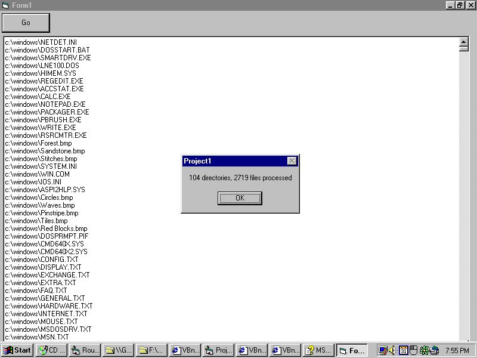

<div align="center">

## List All Files in Folder plus Subfolders \(Simple, One Function\)


</div>

### Description

Given a pathname, this function will

return a string containing a list of

all files in that folder plus subfolders.

Much easier than other examples posted here!

A single recursive function, with no

API's or special types needed.
 
### More Info
 
A pathname to the directory you want to process.

A string containing all files in that

folder + subfolders.

Kinda slow. For speed use the FindFirstFile and FindNextFile API's, but beware, they're more complex to set up.


<span>             |<span>
---                |---
**Submitted On**   |
**By**             |[Kamilche](https://github.com/Planet-Source-Code/PSCIndex/blob/master/ByAuthor/kamilche.md)
**Level**          |Beginner
**User Rating**    |5.0 (15 globes from 3 users)
**Compatibility**  |VB 5\.0, VB 6\.0
**Category**       |[Miscellaneous](https://github.com/Planet-Source-Code/PSCIndex/blob/master/ByCategory/miscellaneous__1-1.md)
**World**          |[Visual Basic](https://github.com/Planet-Source-Code/PSCIndex/blob/master/ByWorld/visual-basic.md)
**Archive File**   |[](https://github.com/Planet-Source-Code/kamilche-list-all-files-in-folder-plus-subfolders-simple-one-function__1-14891/archive/master.zip)


### Source Code

```
Private Function FileList(ByVal Pathname As String, Optional DirCount As Long, Optional FileCount As Long) As String
  'Returns a string containing all files
  'at this directory level and lower.
  'Example of usage:
  '  RichTextBox1.Text = FileList("c:\windows")
  Dim ShortName As String, LongName As String
  Dim NextDir As String
  Static FolderList As Collection
  Screen.MousePointer = vbHourglass
  'First time through only, create collection
  'to hold folders waiting to be processed.
  If FolderList Is Nothing Then
    Set FolderList = New Collection
    FolderList.Add Pathname
    DirCount = 0
    FileCount = 0
  End If
  Do
    'Obtain next directory from list
    NextDir = FolderList.item(1)
    'Remove next directory from list
    FolderList.Remove 1
    'List files in directory
    ShortName = Dir(NextDir & "\*.*", vbNormal Or _
                     vbArchive Or _
                     vbDirectory)
    Do While ShortName > ""
      If ShortName = "." Or ShortName = ".." Then
        'skip it
      Else
        'process it
        LongName = NextDir & "\" & ShortName
        If (GetAttr(LongName) And vbDirectory) > 0 Then
          'it's a directory - add it to the list of directories to process
          FolderList.Add LongName
          DirCount = DirCount + 1
        Else
          'it's a file - add it to the list of files.
          FileList = FileList & LongName & vbCrLf
          FileCount = FileCount + 1
        End If
      End If
      ShortName = Dir()
    Loop
  Loop Until FolderList.Count = 0
  Screen.MousePointer = vbNormal
End Function
```

